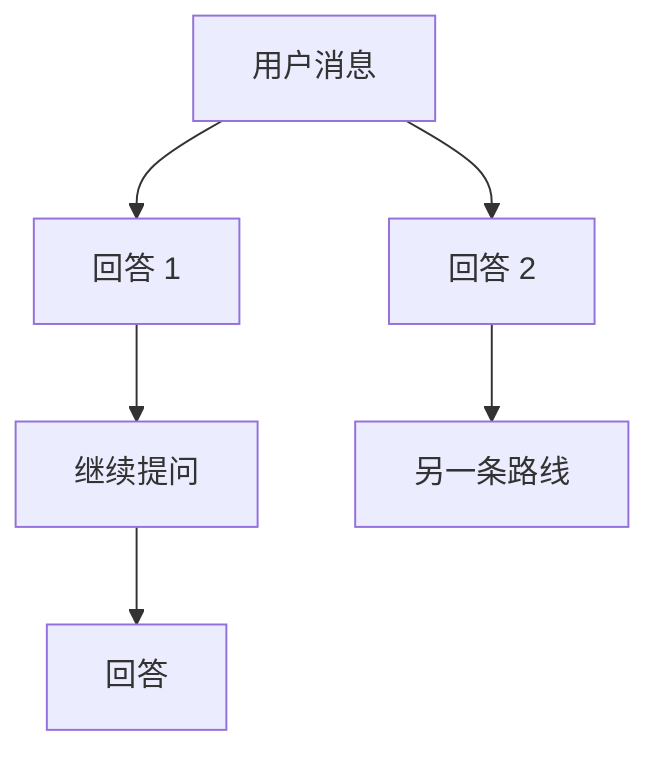

# 存档点、历史记录与树状对话架构升级计划

## 文档目标

本计划集中处理以下三类问题：

1. 修复并完善存档点功能，包括工作区边界、恢复正确性、增量链、并发写入和错误反馈。
2. 增强存档排除功能，默认排除日志、模型权重、数据集、缓存、构建产物和扩展自身数据，同时提供可解释的排除预览。
3. 优化对话历史记录的读写性能，减少长对话中的全量读取、全量重写、重复序列化和重复 IPC。
4. 将当前破坏性“重试 / 编辑后重试”改造成类似 DeepSeek 官网的树状分叉：
   - 重新生成时保留旧回答；
   - 编辑消息时保留原消息和原分支；
   - 同一对话中可以切换不同候选；
   - 每个候选可以继续向下发展；
   - 文件存档、TODO、Build、用量统计和上下文裁剪与当前活跃分支保持一致。

---

## TODO LIST

### 第一阶段：存档点正确性与安全边界

- [x] CP-01：给存档点记录增加工作区身份，恢复前校验当前工作区
- [x] CP-02：支持多根工作区存档，不再只备份 `workspaceFolders[0]`
- [x] CP-03：给存档创建、恢复、合并和删除增加工作区级互斥锁（创建/恢复已接入 `CheckpointOperationLock`；删除/按索引删除/批量删除已接入，锁支持同 owner 可重入避免 create 锁内清理死锁）
- [x] CP-04：恢复前取消当前会话运行，并等待相关写工具真正结束（写工具等待已由互斥锁覆盖；`CheckpointHandlers.restoreCheckpoint` 已接入取消会话流 + 关联活跃 SubAgent）
- [x] CP-05：修复批量删除部分增量链后留下断链存档的问题（保留节点祖先链闭包计算，被依赖祖先强制保留）
- [x] CP-06：修复存档路径可能通过 `..` 越过工作区的问题（`CheckpointRestoreEngine` 路径安全解析）
- [x] CP-07：修复自定义数据目录位于工作区时，存档把自身再次备份的问题（快照构建器强制排除绝对路径）
- [x] CP-08：修复恢复时无法区分“文件不存在”和“文件暂时不可读”的问题（快照构建记录 unreadable/size 排除，恢复返回 `unbackedPaths` 显示路径，前端明确提示）
- [x] CP-09：明确并实现恢复时撤销工具新建文件的语义（新增 `checkpoint.previewRestore` 预览 + 确认框展示待删除文件清单；快照后新建文件默认保留，用户确认后由 `deleteUntrackedFiles` 删除；`RestoreEngine` 提取 `computeRestorePlan` 纯计算，预览与执行严格一致）
- [x] CP-10：恢复失败、部分失败和存档损坏时向前端展示明确错误（`failures` + `error` 摘要 + 前端恢复确认展示）
- [x] CP-11：修复回档并重试 / 删除时，后端删除失败后仍继续执行的问题（前端 deleteMessage 失败中止流程；后端删除失败不再静默）
- [x] CP-12：修复普通恢复与正在运行的流、主会话工具、SubAgent 并发修改文件的问题（互斥锁覆盖写工具并发，恢复前取消流与 SubAgent）
- [x] CP-13：补齐默认启用存档的写工具列表（insert_code/delete_code/search_in_files/media/plan/design/progress/review 系列）
- [x] CP-14：补充存档点正确性、并发和工作区边界测试（新增 `CheckpointManagerWorkspace.test.ts` 6 用例）

### 第二阶段：存档点排除文件功能

- [x] EX-01：建立强制排除、默认类别、自定义规则和大小限制四层排除模型
- [x] EX-02：强制排除 `.git`、`node_modules` 和扩展自身存储绝对路径
- [x] EX-03：新增日志文件默认排除类别
- [x] EX-04：新增 AI / ML 模型权重和模型分片默认排除类别
- [x] EX-05：新增数据集、缓存、虚拟环境和构建产物默认排除类别
- [x] EX-06：新增大型媒体、归档和二进制产物默认排除类别
- [x] EX-07：增加单文件大小上限，避免哈希大文件时占满内存
- [x] EX-08：设置页增加默认类别开关和自定义排除模式编辑器
- [x] EX-09：增加“预览排除结果”和“为什么被排除”功能
- [x] EX-10：存档记录保存完整排除规则快照和排除统计
- [x] EX-11：恢复时区分快照规则和当前规则，并向用户解释跳过原因
- [x] EX-12：增加排除配置校验，拒绝危险或无意义的规则
- [x] EX-13：补充嵌套 `.gitignore`、否定规则、大小限制和存储自排除测试

### 第三阶段：存档性能与元数据改造

- [x] CPF-01：把完整 `fileHashes` 和 `fileStats` 从会话元数据迁到独立 manifest
- [x] CPF-02：会话元数据只保留存档摘要和 manifest 引用
- [x] CPF-03：前端只接收轻量 `CheckpointSummary`
- [x] CPF-04：移除 `loadConversationForView` 中重复下发的完整存档数据
- [x] CPF-05：修复只读 `tool_batch` 也创建全工作区存档的问题
- [x] CPF-06：文件哈希、复制和恢复改为有界并发
- [x] CPF-07：大文件哈希改为流式读取，不再使用整文件 `readFile`
- [x] CPF-08：为增量链建立文件路径索引，避免逐文件逐节点 `fs.access`
- [x] CPF-09：创建存档时记录磁盘占用，设置页不再重复扫描目录
- [x] CPF-10：存档查询、磁盘统计和批量删除改为非阻塞长任务
- [x] CPF-11：为存档创建、恢复和清理增加进度与取消能力
- [x] CPF-12：拆分过大的 `CheckpointManager.ts`

### 第四阶段：对话历史性能

- [x] HIS-01：实现 append-only 尾段写入，普通追加不再重写全部历史
- [x] HIS-02：仅在删除、编辑、回档、分支切换时执行全量重写
- [x] HIS-03：同一工具迭代内复用已经加载的历史快照
- [x] HIS-04：消除上下文裁剪和 Token 计算中的重复全量历史读取
- [x] HIS-05：历史段文件使用有界并发读取
- [x] HIS-06：增加带版本和失效机制的历史段 LRU 缓存
- [x] HIS-07：减少 TranscriptRepository 中重复的全历史深拷贝
- [x] HIS-08：用量索引改为增量维护或按需惰性重建
- [x] HIS-09：合并 `updatedAt`、`messageCount`、`preview` 元数据写入
- [x] HIS-10：对话列表增加批量元数据接口，减少逐对话 IPC
- [x] HIS-11：元数据完整性检查不再解析末段历史
- [x] HIS-12：优化前端流式期间的全窗口 computed 扫描
- [x] HIS-13：首屏消息先展示，再异步补拉更早历史
- [x] HIS-14：补充历史追加、段边界、缓存失效和崩溃恢复测试

### 第五阶段：稳定消息 ID 与树状分支底座

- [ ] BR-01：给后端 `Content` 增加稳定、持久化的消息节点 ID
- [ ] BR-02：旧历史读取时惰性补齐消息 ID，并保证幂等
- [ ] BR-03：新增版本化的 `BranchGraph` 数据模型
- [ ] BR-04：新增分支 sidecar 存储，不把非活跃分支塞入主历史数组
- [ ] BR-05：主历史始终只保存当前活跃路径
- [ ] BR-06：增加分支图读取、写入、删除和迁移接口
- [ ] BR-07：分支操作统一进入会话写锁
- [ ] BR-08：新增纯函数形式的分支图操作模块和单元测试
- [ ] BR-09：现有跨对话“创建分支”记录 `sourceNodeId`

### 第六阶段：树状重 roll 与候选切换

- [ ] TREE-01：将破坏性重试改成保留旧回答的 reroll
- [ ] TREE-02：同一父节点下支持多个助手候选
- [ ] TREE-03：编辑用户消息时创建新的用户消息分支，不覆盖原消息
- [ ] TREE-04：支持左右切换同一父节点下的候选
- [ ] TREE-05：每个候选都可以继续向下对话
- [ ] TREE-06：切换候选时重新构建当前活跃路径
- [ ] TREE-07：切换后重建 TODO、Build、上下文裁剪和工具响应索引
- [ ] TREE-08：用量统计默认只统计当前活跃路径
- [ ] TREE-09：增加分支删除、分支重命名和分支修剪
- [ ] TREE-10：增加候选切换器和分支状态 UI
- [ ] TREE-11：增加完整分支树查看面板
- [ ] TREE-12：扩展标签页快照，保存分支图和当前候选位置
- [ ] TREE-13：增加流式生成期间的分支操作互斥
- [ ] TREE-14：补充 reroll、编辑分支、切换分支和竞态测试

### 第七阶段：树状分支与工作区存档联动

- [ ] BCP-01：存档记录关联消息节点 ID 和分支 ID
- [ ] BCP-02：每个分支记录对应的工作区存档头节点
- [ ] BCP-03：切换代码分支时明确工作区文件恢复语义
- [ ] BCP-04：支持“仅切换聊天分支”和“聊天与工作区一起切换”两种模式
- [ ] BCP-05：工作区无法安全恢复时禁止静默切换
- [ ] BCP-06：分支删除时按引用计数清理不再使用的存档
- [ ] BCP-07：分支存档共享不可变内容，避免重复复制
- [ ] BCP-08：补充聊天分支和工作区状态一致性测试

### 第八阶段：迁移、测试与发布

- [ ] MIG-01：旧线性对话首次分支时建立基线 BranchGraph
- [ ] MIG-02：旧存档记录迁移到 manifest 模式
- [ ] MIG-03：旧 `ignorePatterns` 兼容读取为新排除快照
- [ ] MIG-04：为迁移增加版本号、失败回滚和可恢复中间状态
- [ ] MIG-05：增加存档和历史数据完整性检查工具
- [ ] MIG-06：更新中、英、日三语文案
- [ ] MIG-07：执行后端 Jest、前端 Vitest、typecheck 和 build
- [ ] MIG-08：更新 README 和 CHANGELOG `[Unreleased]`
- [ ] MIG-09：进行大工作区、长对话和大量分支性能基准测试

---

# 当前执行状态

## 已完成

- 已修复流式报错后重试残留半截回答的问题（详见下方「流式失败重试残留」小节）。
- 已完成存档模块和调用链的代码盘点。
- 已确认 Phase 1 的主要风险点：工作区身份缺失、单根工作区、多根工作区路径、路径越界、存档操作与写工具竞态、纯只读 tool_batch 创建存档、大文件整文件哈希。
- 已新增工作区身份与路径安全基础模块：
  - `backend/modules/checkpoint/CheckpointWorkspace.ts`
- 已新增存档操作互斥基础模块：
  - `backend/modules/checkpoint/CheckpointOperationLock.ts`（支持同 owner 可重入，create 锁内清理旧存档不死锁）
- 已为 `FileWriteLockManager` 增加可等待的 `acquire()` 接口（含 `checkpoint` 类型锁持有者）。
- 已为工作区身份、路径安全和存档操作锁补齐单元测试（`CheckpointWorkspace.test.ts` 18 用例、`CheckpointOperationLock.test.ts` 11 用例，全部通过）。
- 已新建独立的快照构建器 `CheckpointSnapshotBuilder`：多根工作区扫描、强制排除绝对路径（防存档自备份）、大小上限（参数化，默认不限制，默认值待确认）、流式哈希、有界并发；配套 7 用例测试。
- 已新建独立的恢复引擎 `CheckpointRestoreEngine`：增量链文件索引 O(1) 查询、scoped 路径安全解析（兼容旧相对路径存档）、失败清单区分原因；配套 6 用例测试。
- `CheckpointManager.getFileHash` / `computeFileHashes` 已改为流式哈希（等值替换，不再整文件 readFile）。
- ✅ 已把 `CheckpointManager.createCheckpoint` / `restoreCheckpoint` 主流程切换到新模块：
  - 创建：`buildWorkspaceSnapshot` 多根扫描 + 存档目录强制自排除 + 流式哈希有界并发 + stat 复用；新存档记录 `workspaceRoots` / `workspaceFingerprint`；备份目录改用 scoped 布局（`cp_xxx/ws_xxx/relative`），多根同名文件不再互相覆盖；同一对话切换工作区后自动断开旧增量链（从新的完整备份开始）。
  - 恢复：`restoreWorkspaceSnapshot` 增量链索引（按 `changes` 限定节点备份文件边界，未变化文件从 base 恢复）+ 备份源/目标路径双重安全校验（`backupDir` 越界视为链上缺失，目标路径逐层符号链接检查）+ 失败清单；新存档恢复前校验工作区身份（跨项目拒绝）；旧存档（相对路径键）单根兼容、多根明确拒绝；只删除快照 `fileHashes` 记录过的路径（#29 语义显式化），`unbackedPaths` 受保护；无 `fileHashes` 的旧存档以备份目录内容为目标且绝不删除当前文件。
  - 创建/恢复均接入 `checkpointOperationLockManager.runExclusive`（工作区级互斥 + 全局文件写锁等待）。
  - 新增 `CheckpointManagerWorkspace.test.ts` 6 用例 + 增量链/路径安全回归 6 用例；checkpoint 模块 85 用例全过，后端全量 784 用例通过，前后端 typecheck 通过。
- ✅ Phase 1 剩余任务（CP-03/04/05/08/10/11/12/13）已完成：
  - CP-03：删除/按索引删除/批量删除全部接入 `checkpointOperationLockManager.runExclusive('delete')`；锁增加同 owner 可重入（引用计数），`createCheckpoint` 锁内清理旧存档（cleanup → merge → delete）不再嵌套等待自己。
  - CP-05：`deleteCheckpointsBatch` 改为祖先链闭包计算——从所有保留节点向前遍历完整基链，被直接/间接依赖的祖先强制保留并返回 rejectedIds（旧实现只查一层：链 A→B→C 删 {A,B} 会删 A 留 B 导致 B 断链）。
  - CP-08：恢复结果返回 `unbackedPaths`（快照时大小超限/不可读/复制失败的文件，scoped 键转显示路径，上限 50 条），前端恢复确认后明确提示这些文件未被备份、恢复不会处理。
  - CP-10：`restoreCheckpoint` 返回 `failures` + `error` 摘要；前端 `MessageList.confirmRestore` 展示失败/部分失败/未备份提示；设置页批量删除展示「被依赖保留」与「删除失败」数量。
  - CP-11：前端 `restoreAndRetry` / `restoreAndDelete` 中 `deleteMessage` 失败时中止流程并展示错误，不再静默继续重试；后端各删除路径磁盘删除失败记录 warn（元数据已移除，残留为孤儿目录不影响正确性）。
  - CP-04/CP-12：`CheckpointHandlers.restoreCheckpoint` 恢复前取消该对话的流式请求（`streamAbortControllers.cancel`）并取消关联的活跃 SubAgent（`subAgentRunEventBus.getSnapshots` 按 conversationId 匹配 + `subAgentRunController.cancel`）。
  - CP-13：默认 `beforeTools` / `afterTools` 补齐 `insert_code`、`delete_code`、`search_in_files`、`remove_background` / `crop_image` / `resize_image` / `rotate_image`、`create_plan` / `update_plan` / `create_design` / `update_design` / `create_progress` / `update_progress` / `record_progress_milestone` / `create_review` / `record_review_milestone` / `finalize_review` / `reopen_review`；`search_in_files` 纯 search 模式（非 replace）不再创建存档。
  - 新增测试：可重入锁 3 用例、批量删除祖先闭包 1 用例、恢复返回 `unbackedPaths` 1 用例。checkpoint 模块 90 用例全过，后端全量 789 用例通过，前端 Vitest 83 用例通过，前后端 typecheck 通过。
- ✅ CP-09（恢复确认流程）已完成，采用主人确认的语义「每次恢复展示待删除文件清单让用户确认」：
  - 新增 `checkpoint.previewRestore`：`CheckpointManager.previewRestore` 在恢复互斥锁内计算恢复计划（`computeRestorePlan` 纯计算，无副作用），返回将恢复/删除/跳过数量、`deletablePaths`（快照记录过、按 #29 白名单删除）与 `untrackedPaths`（快照后新建文件，默认保留）。
  - `restoreCheckpoint` 新增 `deleteUntrackedFiles` 选项：缺省 false 保持 #29 保护（不删快照后新建文件）；前端确认框展示完整清单后传 true，实现「撤销工具新建文件」。`RestoreEngine` 新增 `deleteUntrackedFiles` 选项，删除执行合并白名单内 + 已确认的未跟踪文件。
  - 前端四个恢复入口（普通恢复 / 回档并重试 / 回档并删除 / 回档并编辑）统一先 `previewRestore` 再弹确认框：确认框展示将删除文件清单（含「快照后新建文件」提示）、未备份文件提示、数量摘要；确认后按入口执行对应操作；预览失败（链断裂/存档缺失）直接展示错误不弹确认框。`ConfirmDialog` 增加插槽支持。
  - 新增测试：`computeRestorePlan` 白名单/受保护/未跟踪过滤 1 用例、`previewRestore` 无副作用 + 默认不删未跟踪文件 + 确认后删除 1 用例。checkpoint 模块 92 用例全过，后端全量 791 用例通过，前端 Vitest 83 用例通过，前后端 typecheck 通过。
- ✅ 自我审查修复（全部完成）：
  - 回档三连（restoreAndRetry/Delete/Edit）的 `deleteUntrackedFiles` 改为调用方显式传参（默认 false），确认框确认后传 true，绕过确认框的调用不会静默删除快照后新建文件；
  - `deleteMessage` 失败中止后重新 `loadHistory` 拉回前端窗口与后端历史一致；恢复确认框取消时清理 `pendingRestoreAction`；预览期间恢复按钮显示 loading（`isRestorePreviewing` 入 store）；
  - `pruneMissingBackupCheckpointRecords` 顺带清理孤儿备份目录（`cp_*` 格式、无记录引用）；设置页存档详情展示未备份文件数（悬停显示路径）；
  - `CheckpointOperationLock` 可重入放宽为子集即放行；新增前端 `checkpointActions.test.ts` 9 用例。
  - checkpoint 模块 94 用例全过，后端全量 793 用例通过，前端 Vitest 92 用例通过，前后端 typecheck 通过。
- ✅ 深度审查修复（第二轮，全部完成）：
  - 快照强制排除范围从存档目录扩大为整个扩展存储根（`path.dirname(checkpointsDir)`）：自定义数据目录位于工作区内时，memory/conversations 等扩展数据不再进入存档（此前只排除 checkpoints 子目录，是 CP-07 的覆盖缺口）；
  - 恢复时「删除多余空目录」纳入 `deleteUntrackedFiles` 确认控制：快照后新建的空目录默认保留（#29 语义），`computeRestorePlan` 新增 `untrackedEmptyDirs`，预览清单一并展示空目录，确认后才清理；
  - legacy 存档预览返回 `legacy` 标记（restored/skipped = -1）：前端展示「恢复以备份内容为准，可能覆盖文件，不删除任何文件」，不再误判为「无变更」；
  - 恢复确认框打开期间恢复按钮禁用（`showRestoreConfirm` 并入 disabled），防止重复点击覆盖确认框内容；设置页 unbacked 悬停路径去除 `ws_xxx/` 前缀；
  - 新增测试：扩展存储整根排除增强 1 用例、空目录默认保留 + 确认后清理 1 用例。
  - checkpoint 模块 95 用例全过，后端全量 794 用例通过，前端 Vitest 92 用例通过，前后端 typecheck 通过。

## 流式失败重试残留（已修复）

问题：流式过程中后端报错时，后端不会持久化半截 assistant 消息，但前端窗口会保留有内容的半截消息；点击错误通知上的「重试」
（`retryAfterError`）之前不会清理，导致重试后窗口/历史出现半截回答残留。

修复内容（全部在前端）：

- `handleError` 保留有内容的半截消息时记录 `_failedStreamMessageId`。
- 新增 `rollbackFailedStreamMessage`：删除窗口中的半截消息、清理其索引后的检查点并清空记录。
- `retryAfterError` 重试前回滚；若半截消息非 localOnly（后端可能已持久化）则防御性调用 `deleteMessage`。
- 错误条「关闭」按钮改为 `dismissError`（一并清理半截消息）；发送新消息时也清理失败残留。
- 工具响应后的「继续对话」语义不受影响（不删除正常历史）。
- 回归测试：`frontend/src/__tests__/stores/streamErrorRetry.test.ts`（12 用例，通过）。

## 当前阶段

Phase 1：存档点正确性与安全边界（全部完成 ✅）。

## 当前阻塞

- `CheckpointManager.ts` 仍超过 1700 行，模块拆分（CPF-12）留到 Phase 3 性能阶段执行。

## 下一步

1. ✅ 已为工作区身份、路径安全和存档操作锁补齐单元测试。
2. ✅ 已新建 `CheckpointSnapshotBuilder`（多根扫描、排除、大小限制、流式哈希、有界并发）。
3. ✅ 已新建 `CheckpointRestoreEngine`（路径校验、增量链恢复、失败清单）。
4. ✅ 已将 `CheckpointManager.createCheckpoint` / `restoreCheckpoint` 主流程切换到新模块（SnapshotBuilder + RestoreEngine + 工作区互斥锁；旧存档相对路径键由 RestoreEngine 兼容解析；新增工作区边界集成测试 6 用例）。
5. ✅ 已接入恢复取消（CP-04/CP-12）：`CheckpointHandlers.restoreCheckpoint` 恢复前取消会话流（StreamAbortManager）与关联活跃 SubAgent（runEventBus 按 conversationId 匹配 + runController.cancel）。
6. ✅ 已完成删除失败传播与前端错误反馈（CP-05/CP-08/CP-10/CP-11/CP-13）：批量删除闭包计算、删除失败不再继续执行、恢复/删除结果前端明确展示、默认写工具列表补齐。
7. ✅ 已修复流式失败重试残留（前端回滚 + 回归测试）。
8. ✅ 已完成 CP-09 恢复预览确认流程（`checkpoint.previewRestore` + 确认框展示待删除文件清单 + `deleteUntrackedFiles` 确认后删除快照后新建文件）。
9. Phase 1 全部完成，下一步进入 Phase 2（存档排除功能 EX-01 ~ EX-13）：默认排除类别、排除预览、大小上限、manifest 独立存储。

---

# 第一部分：存档点问题与修复方案

## 1. 工作区身份缺失

### 当前问题

存档记录只保存普通相对路径，没有记录这些文件属于哪个工作区。恢复时又直接使用当前窗口第一个工作区。

这会导致：

- 项目 A 的存档可能被恢复到项目 B；
- 多根工作区只备份第一个根目录；
- 工具修改第二个工作区时，存档看起来创建成功，实际没有备份修改文件。

### 目标设计

存档记录增加工作区信息：

```ts
interface CheckpointWorkspaceRoot {
  id: string
  name: string
  uri: string
}

interface CheckpointRecord {
  // 现有字段
  workspaceRoots: CheckpointWorkspaceRoot[]
  workspaceFingerprint: string
}
```

存档中的路径使用：

```text
workspace-id/relative/path
```

而不是没有工作区身份的：

```text
relative/path
```

### 恢复规则

1. 当前工作区集合与存档记录一致时，直接恢复。
2. 当前工作区缺少某个根目录时，拒绝恢复该根目录并显示原因。
3. 工作区名称相同但 URI 不同时，不自动推断。
4. 需要跨目录恢复时，必须由用户明确选择根目录映射。
5. 恢复入口不能只依赖前端过滤，后端必须再次校验。

### 验收标准

- 项目 A 的存档无法静默写入项目 B。
- 多根工作区中的每个根目录都能独立创建和恢复。
- 缺少根目录时返回明确错误。
- 损坏元数据不能绕过工作区边界。

---

## 2. 存档操作与工具写入并发

### 当前问题

恢复操作没有进入文件写锁，也不会确保当前工具真正结束。恢复过程中，主会话工具、终端命令或 SubAgent 可能继续写文件。

### 目标设计

新增工作区级存档锁：

```ts
interface CheckpointOperationLock {
  workspaceIds: string[]
  operation: 'create' | 'restore' | 'merge' | 'delete'
  ownerId: string
}
```

恢复流程：

1. 请求取消当前对话运行；
2. 等待当前写工具退出或进入安全终态；
3. 取消 pending diff；
4. 获取全部目标工作区的根级写锁；
5. 验证存档、增量链和路径；
6. 执行恢复；
7. 刷新编辑器；
8. 释放写锁；
9. 重建派生元数据。

### 验收标准

- 恢复期间其他写工具不能修改目标工作区。
- 写工具运行期间点击恢复不会产生混合文件状态。
- 创建存档时文件修改不会导致记录哈希和备份内容不一致。
- 所有异常路径都会释放锁。

---

## 3. 批量删除破坏增量链

### 问题示例

```text
A（完整） → B（增量） → C（增量）
```

用户请求删除 A 和 B，但保留 C。

当前单次依赖检查可能：

- 拒绝删除 B；
- 仍然删除 A；
- B 继续引用已经删除的 A；
- B 和 C 都无法恢复。

### 修复方式

删除集合必须做闭包计算：

1. 先得到用户请求删除集合。
2. 计算最终保留节点。
3. 从所有保留节点向前遍历完整祖先链。
4. 所有被保留节点依赖的祖先都加入强制保留集合。
5. 最终删除集合 = 请求集合 - 强制保留集合。
6. 返回被拒绝节点及具体依赖原因。

### 验收标准

- 任意批量删除后，剩余存档的增量链都完整。
- 后端返回每个被拒绝节点的依赖者。
- 前端显示实际删除数量和被拒绝数量。
- 不再出现界面显示可恢复、点击后才发现断链的存档。

---

## 4. 恢复时撤销工具新建文件

### 当前问题

恢复目标中不存在的文件不会被删除，因此回档到工具执行前不能撤销该工具新建的文件。

### 需要确认的产品语义

推荐采用以下语义：

- 普通“恢复工作区到存档点”：恢复存档已跟踪文件，但对快照后新增文件先展示确认。
- “回档并重试 / 回档并编辑”：默认删除明确由被撤销工具创建的文件。
- 快照时被忽略、无法读取或无法备份的文件永远不能自动删除。
- 无法确认归属的新文件默认保留。

### 建议新增记录

```ts
interface CheckpointRecord {
  visiblePaths?: string[]
  unbackedPaths?: string[]
  createdByOperation?: string[]
  deletedByOperation?: string[]
}
```

如果工具有明确目标路径，则优先使用工具执行结果提供的文件变更清单，而不是仅根据快照差异猜测。

### 验收标准

- `write_file` 创建的新文件可以被“回档并重试”撤销。
- 用户自己在工具执行后创建的无关文件不会被静默删除。
- 被忽略和备份失败的文件不会被删除。
- 删除前可以看到待删除文件清单。

---

## 5. 路径边界与损坏存档

### 修复要求

所有来自存档元数据的路径都必须重新校验：

```ts
const target = path.resolve(workspaceRoot, relativePath)
const relative = path.relative(workspaceRoot, target)

if (
  relative === '' ||
  relative.startsWith('..') ||
  path.isAbsolute(relative)
) {
  throw new Error('Checkpoint path escapes workspace')
}
```

还需要：

- 校验 `backupDir` 只能是安全目录名；
- 拒绝 `.`、`..`、绝对路径和空路径；
- 使用真实路径检查 junction 和符号链接；
- 备份源路径必须位于存档目录内；
- 恢复目标路径必须位于工作区内。

### 验收标准

- 手工修改存档元数据不能写入工作区外。
- 符号链接不能绕过路径边界。
- 非法路径返回明确的损坏存档错误。

---

## 6. 恢复错误反馈

恢复结果应区分：

```ts
type RestoreFailureReason =
  | 'checkpoint_not_found'
  | 'workspace_mismatch'
  | 'chain_broken'
  | 'backup_missing'
  | 'missing_in_chain'
  | 'hash_mismatch'
  | 'copy_failed'
  | 'delete_failed'
  | 'directory_create_failed'
  | 'unreadable_current_file'
  | 'unsafe_path'
  | 'operation_conflict'
```

前端至少显示：

- 恢复成功；
- 部分恢复；
- 完全失败；
- 恢复、删除和跳过的文件数量；
- 失败文件列表；
- 存档损坏原因；
- 工作区不匹配原因。

普通恢复不能再丢弃后端返回结果。

---

# 第二部分：存档排除功能

## 1. 排除规则分层

排除功能分为四层：

### 第一层：强制排除

强制排除不可由 `!` 否定规则重新纳入。

包括：

- `.git/`
- `node_modules/`
- 当前扩展数据存储绝对路径
- 当前存档目录绝对路径
- 存档创建过程中使用的临时目录

强制排除应使用“目录类型 + 真实绝对路径”判断，不能只判断字符串片段。

### 第二层：默认排除类别

默认排除类别可以在设置页分别关闭，也可以通过用户自定义否定规则重新纳入。

建议类别：

- 日志；
- AI / ML 模型；
- 数据集；
- 缓存；
- Python 虚拟环境；
- 构建产物；
- 大型媒体；
- 压缩包与二进制产物；
- 扩展生成数据。

### 第三层：项目 `.gitignore`

继续支持：

- 根目录 `.gitignore`；
- 嵌套 `.gitignore`；
- anchored 规则；
- 否定规则；
- 目录作用域。

### 第四层：用户自定义模式

用户在设置页添加的规则最后生效。

支持：

```text
*.log
generated/
**/cache/**
!important/model.gguf
```

但不能覆盖强制排除边界。

---

## 2. 建议默认排除模式

### 日志文件

```gitignore
*.log
*.log.*
logs/
log/
npm-debug.log*
yarn-debug.log*
yarn-error.log*
pnpm-debug.log*
lerna-debug.log*
```

### AI / ML 模型权重与分片

```gitignore
*.safetensors
*.pt
*.pth
*.onnx
*.h5
*.hdf5
*.pb
*.ckpt
*.gguf
*.ggml
*.tflite
*.torchscript
*.mlmodel
*.joblib
*.engine
*.trt
*.mar
```

以下扩展名不建议直接默认排除，应交给大小上限或用户自定义：

```text
*.bin
*.dat
*.model
```

原因是这些扩展名过于通用，可能包含项目真正需要恢复的小型文件。

### 数据集与大规模数据

```gitignore
data/
datasets/
dataset/
*.parquet
*.arrow
*.feather
*.tfrecord
```

`data/` 可能是项目源码依赖的重要目录，因此建议将“数据集目录”类别默认开启，但在设置页显著展示，允许用户关闭。

### 缓存

```gitignore
.cache/
.mypy_cache/
.pytest_cache/
.ruff_cache/
.hypothesis/
.tox/
.nox/
__pycache__/
*.pyc
*.pyo
```

### Python 虚拟环境

```gitignore
.venv/
venv/
virtualenv/
```

不建议默认排除所有名为 `env/` 的目录，避免误伤配置目录。

### 构建产物

```gitignore
dist/
build/
.next/
.nuxt/
.gradle/
target/
coverage/
.nyc_output/
*.tsbuildinfo
```

`target/` 可能用于普通项目目录，建议作为单独可关闭规则展示。

### 大型媒体与设计源文件

```gitignore
*.mp4
*.mkv
*.mov
*.avi
*.flac
*.psd
*.tiff
*.raw
```

不建议默认排除常见小型图片，例如：

```text
*.png
*.jpg
*.svg
```

这些文件经常是前端项目的重要源码资源。

### 压缩包与二进制产物

```gitignore
*.zip
*.tar
*.tar.gz
*.tgz
*.7z
*.rar
*.iso
*.dmg
*.exe
*.dll
```

### 扩展自身数据

目录名规则可以包含：

```gitignore
.limcode/
.graycode/
```

但真正的存档存储自排除必须根据绝对路径完成，不能依赖目录名称。

---

## 3. 单文件大小上限

### 目标

避免 `fs.readFile()` 把数 GB 的模型权重整体读入内存并计算 MD5。

### 建议配置

```ts
interface CheckpointExclusionConfig {
  maxFileSizeBytes: number
}
```

建议默认值：

```text
20 MiB
```

允许：

```text
0 = 不限制
```

### 实施前需要主人确认

以下默认值属于业务语义，正式修改前需要确认：

1. 默认上限使用 20 MiB、50 MiB 还是 100 MiB；
2. 超限文件是完全排除，还是只记录存在但不复制；
3. 恢复时是否显示“该文件未被备份”的警告；
4. `data/`、`datasets/` 和 `target/` 是否默认排除。

### 推荐语义

超限文件应记录为：

```ts
interface ExcludedCheckpointPath {
  path: string
  reason: 'size'
  size: number
}
```

而不是静默消失。

这样恢复时可以明确说明：

```text
model.gguf 未被该存档备份：文件大小 7.2 GiB，超过 20 MiB 上限。
```

---

## 4. 可解释的排除结果

新增：

```ts
type CheckpointExcludeReason =
  | 'forced'
  | 'default'
  | 'gitignore'
  | 'custom'
  | 'size'
  | 'unsupported_file_type'
  | 'unreadable'

interface CheckpointExcludedEntry {
  path: string
  reason: CheckpointExcludeReason
  rule?: string
  source?: string
  size?: number
}

interface CheckpointExclusionSummary {
  excludedCount: number
  excludedBytes: number
  byReason: Record<string, {
    count: number
    bytes: number
  }>
  samples: CheckpointExcludedEntry[]
}
```

样本列表必须限制数量，避免又把大量路径写进元数据。完整排除清单可以放进 manifest。

### 设置页预览

增加“预览排除结果”按钮，显示：

```text
日志：32 个文件，18.4 MiB
模型权重：4 个文件，21.7 GiB
缓存：2,145 个文件，310 MiB
.gitignore：88 个文件，42 MiB
大小限制：7 个文件，28.2 GiB
```

点击类别后显示有限数量的示例文件和命中的具体规则。

---

## 5. 排除规则快照

现有存档中的 `ignorePatterns` 信息不足，应升级为：

```ts
interface CheckpointIgnoreSnapshot {
  version: number
  forcedRulesVersion: number
  defaultProfileVersion: number
  enabledProfiles: Record<string, boolean>
  maxFileSizeBytes: number
  customPatterns: string[]
}
```

恢复时：

- 当前规则决定当前允许触碰的文件；
- 存档规则用于解释快照当时为什么没有备份某个文件；
- 当前规则和快照规则不一致时，在结果中明确显示；
- 不允许因为旧存档规则较宽而覆盖当前明确忽略的文件。

---

# 第三部分：存档性能改造

## 1. Manifest 独立存储

### 当前问题

每个存档都把全工作区的 `fileHashes` 和 `fileStats` 写进会话 metadata。存档数量和文件数量增加后，metadata 会快速膨胀。

### 新目录格式

```text
checkpoints/
  cp_xxx/
    manifest.json
    files/
      workspace-a/
        src/example.ts
      workspace-b/
        package.json
```

`manifest.json`：

```ts
interface CheckpointManifest {
  version: number
  checkpointId: string
  workspaceRoots: CheckpointWorkspaceRoot[]
  files: Record<string, {
    hash: string
    size: number
    mtimeMs: number
    mtimeNs?: string
    backupSourceCheckpointId?: string
  }>
  emptyDirs: string[]
  changes: FileChange[]
  excluded: CheckpointExcludedEntry[]
  ignoreSnapshot: CheckpointIgnoreSnapshot
}
```

会话 metadata 只保留：

```ts
interface CheckpointSummary {
  id: string
  conversationId: string
  messageNodeId?: string
  messageIndex: number
  toolName: string
  phase: 'before' | 'after'
  timestamp: number
  type: 'full' | 'incremental'
  baseCheckpointId?: string
  contentHash: string
  fileCount: number
  backupBytes: number
  excludedCount: number
  manifestVersion: number
}
```

### 收益

- 切换对话不再下发全部文件哈希；
- 新建存档不需要重写巨大 metadata；
- 设置页只读取摘要；
- 恢复时按 ID 加载单个 manifest；
- 存档损坏可以精确定位到 manifest。

---

## 2. 只读工具批次不创建存档

当前多个工具组成批次后统一使用 `tool_batch`，只要存档工具配置列表非空，就可能创建前后两个工作区快照。

新接口应把真实工具名传入：

```ts
interface ToolBatchCheckpointContext {
  toolNames: string[]
  writeTargets: string[]
  containsWriteTool: boolean
}
```

创建条件：

```ts
toolNames.some(name => configuredTools.includes(name))
```

或者更彻底地复用工具注册信息：

```ts
declaration.readOnly === false
```

### 验收标准

以下批次不创建存档：

```text
read_file + search_in_files(search)
list_files + find_files
get_symbols + find_references
```

以下批次创建存档：

```text
read_file + write_file
search_in_files(replace)
apply_diff + read_file
```

---

## 3. 有界并发

以下操作改为有界并发：

- stat；
- 文件哈希；
- 文件复制；
- 恢复文件；
- 存档目录大小统计；
- 多对话存档摘要读取。

建议并发度：

```text
机械硬盘：4
普通默认：8
SSD：8～16
```

不使用无限 `Promise.all`。

### 大文件哈希

使用流式哈希：

```ts
createReadStream(filePath)
  .pipe(createHash('sha256'))
```

不再：

```ts
await fs.readFile(filePath)
```

---

## 4. 增量链文件索引

当前恢复每个文件都可能从链尾逐个目录执行 `fs.access`。

应在构建增量链后一次生成：

```ts
Map<relativePath, {
  checkpointId: string
  backupPath: string
  hash: string
}>
```

从旧到新应用 `changes`，最新节点覆盖旧节点。

恢复文件时变为 O(1) 查询，而不是：

```text
待恢复文件数 × 增量链长度
```

---

## 5. 存档查询性能

创建存档时直接计算并记录：

```ts
backupBytes
excludedBytes
```

设置页无需重复递归扫描全部目录。

如果旧存档没有大小字段：

- 展开单个对话时按需扫描；
- 扫描结果写回摘要缓存；
- 不在设置页挂载时扫描所有对话和所有存档。

---

# 第四部分：对话历史性能优化

## 1. 当前主要性能问题

项目已经有：

- 分段历史；
- 分页读取；
- 用量索引；
- 前端消息窗口；
- 对话统计缓存。

但普通追加消息时仍然会：

1. 读取完整历史；
2. 修改数组；
3. 深拷贝完整历史；
4. 重写全部历史分段；
5. 重建完整用量索引；
6. 读写 metadata；
7. 工具循环下一步再次读取完整历史。

长对话下，普通追加一条消息的成本会随历史长度持续增加。

---

## 2. Append-only 尾段写入

### 目标

普通追加消息时只修改最后一个历史段和 index。

假设每段 200 条：

```text
history/
  000000.ndjson
  000001.ndjson
  000002.ndjson
history.index.json
```

追加消息时：

- 最后段不足 200 条：只更新最后段；
- 最后段已满：新建下一段；
- 最后写入新的 index；
- 删除、编辑、回档、分支切换继续走全量重写。

### 接口建议

```ts
interface IStorageAdapter {
  appendHistory?(
    conversationId: string,
    contents: Content[]
  ): Promise<void>
}
```

TranscriptRepository 提供明确操作：

```ts
appendContents(contents)
replaceContents(contents)
mutateContents(mutator)
```

不要让 storage 通过深比较猜测这次是不是追加。

### 崩溃一致性

写入顺序：

1. 写临时尾段；
2. 原子替换尾段；
3. 写临时 index；
4. 原子替换 index。

index 仍然是有效历史的提交点。

---

## 3. 同一迭代内复用历史

同一个工具迭代中，上下文裁剪、Token 计算、工具配对和 API 格式化不应分别重新读取完整历史。

建议增加：

```ts
interface ConversationHistorySnapshot {
  conversationId: string
  revision: number
  contents: ReadonlyArray<Content>
}
```

同一逻辑步骤内传递 snapshot：

```ts
getHistoryForAPIFrom(snapshot)
calculateTokensFrom(snapshot)
resolveContextTrimFrom(snapshot)
```

跨越历史写入后必须重新获取 snapshot，不能长期缓存旧引用。

---

## 4. 段级 LRU 缓存

### 缓存键

```text
conversationId + segmentFile + historyRevision
```

### 失效条件

- 当前会话写入；
- index revision 改变；
- 外部文件监听发现变更；
- 数据迁移；
- 删除会话；
- 缓存容量淘汰。

### 约束

- 有明确内存上限；
- 不缓存无限数量的历史；
- 活跃对话优先；
- 返回给外部前保持只读或复制边界；
- 不能破坏“每次读到最新数据”的语义。

---

## 5. 用量索引增量维护

普通追加助手消息时只增加对应的用量条目。

以下操作才重建：

- 删除；
- 编辑；
- 回档；
- 切换分支；
- 导入；
- 旧索引损坏；
- 索引与历史 revision 不一致。

仅追加用户消息或 functionResponse 时，不应重复写入没有变化的用量索引。

---

## 6. 元数据写入合并

前端目前不应分别发送：

```text
updatedAt
messageCount
preview
```

建议合并为一次：

```ts
conversation.updateSummary({
  conversationId,
  messageCount,
  preview
})
```

`updatedAt` 由后端历史提交统一维护。

高频历史写入可以对单纯 `updatedAt` 做短时间合并，但真正的 custom metadata 修改必须立即持久化。

---

## 7. 对话列表批量元数据

新增：

```ts
conversation.getConversationMetadataBatch({
  conversationIds: string[]
})
```

一次返回一页对话摘要，避免每个对话一次 IPC。

对话列表只需要：

```ts
interface ConversationSummary {
  id: string
  title: string
  createdAt: number
  updatedAt: number
  messageCount: number
  preview?: string
  workspaceUri?: string
  integrityStatus?: string
}
```

完整 metadata 只在打开具体对话时读取。

---

## 8. 前端渲染

保留现有消息窗口机制，不进行不必要的全量虚拟列表重写。

优先优化：

- 流式 chunk 到达时不扫描全部 800 条窗口；
- TODO / Build 锚点使用索引或尾部限定扫描；
- 初始页先渲染，再异步补拉；
- 分支切换时替换消息窗口并统一重建索引；
- 候选摘要不包含完整非活跃分支内容。

---

# 第五部分：类似 DeepSeek 的树状重 roll

## 1. 目标交互

### 助手消息重新生成

原本：

```text
用户消息
└── 助手回答 A
```

点击重新生成后：

```text
用户消息
├── 助手回答 A
└── 助手回答 B（当前）
```

界面显示：

```text
‹ 2 / 2 ›
```

用户可以切回回答 A。

### 编辑用户消息

原本：

```text
用户消息 A
└── 助手回答 A1
```

编辑后：

```text
父节点
├── 用户消息 A
│   └── 助手回答 A1
└── 用户消息 B（编辑版本）
    └── 助手回答 B1
```

原消息和原回答都保留。

### 从旧候选继续对话

如果用户切回回答 A，并继续发送新消息：

```text
用户消息
├── 助手回答 A
│   └── 新用户消息
│       └── 新助手回答
└── 助手回答 B
```

这才是真正的树，而不是只保存多个孤立回答。

---

## 2. 核心设计原则

### 主历史只保存活跃路径

主历史 `Content[]` 继续保持线性：

```text
root → active child → active child → tail
```

这样现有功能可以继续使用：

- 分页；
- 上下文裁剪；
- API 格式化；
- functionCall / functionResponse 配对；
- TODO 重放；
- Build 状态；
- 用量统计；
- 存档点消息定位。

非活跃分支保存在独立 sidecar 中。

不把整棵树直接塞进主历史数组，否则：

- 分页总数失真；
- 模型会收到非活跃回答；
- 用量重复统计；
- 工具响应配对混乱；
- 上下文裁剪语义失效。

---

## 3. 稳定消息节点 ID

后端消息必须增加稳定 ID：

```ts
interface Content {
  id?: string
  parentId?: string | null
  // 现有字段
}
```

### 迁移

旧消息没有 ID 时：

1. 加载历史；
2. 按顺序生成 UUID；
3. 建立线性 `parentId`；
4. 在会话写锁中持久化一次；
5. 后续读取不再重复生成。

所有分支 API 使用 `nodeId`，不能继续使用容易漂移的数组下标。

数组下标只作为当前活跃路径的显示位置。

---

## 4. BranchGraph 数据结构

建议新增：

```ts
interface ConversationBranchGraph {
  version: 1
  rootNodeId: string | null
  activeTailNodeId: string | null
  nodes: Record<string, ConversationBranchNode>
}

interface ConversationBranchNode {
  id: string
  parentId: string | null

  role: 'user' | 'model' | 'system'
  parts: ContentPart[]

  kind:
    | 'normal'
    | 'reroll'
    | 'edit'
    | 'continue'
    | 'imported'

  createdAt: number
  timestamp?: number
  modelVersion?: string
  usageMetadata?: UsageMetadata

  activeChildId?: string | null

  label?: string
  deleted?: boolean

  workspaceCheckpointId?: string
}
```

不建议同时存：

```ts
parentId
childrenIds
```

因为双向关系容易写出不一致。

子节点列表通过 `parentId` 建立索引：

```ts
Map<parentId, childIds[]>
```

`activeChildId` 仅表示当前选中的子分支。

---

## 5. Sidecar 存储

建议：

```text
conversations/
  conversation-id/
    history.index.json
    history/
    branches.json
```

`branches.json` 保存：

- 非活跃分支节点；
- 活跃路径节点的摘要或完整副本；
- 当前选择指针；
- 分支标签；
- 分支对应存档引用。

如果节点内容很大，后续可以再按段拆分，但第一版不需要过度设计。

---

## 6. Reroll 流程

新增后端操作：

```ts
rerollFromNode(conversationId, assistantNodeId)
```

处理流程：

1. 验证节点存在于当前活跃路径；
2. 找到它的父用户节点；
3. 保留当前助手节点及其后继子树；
4. 创建新的助手候选节点；
5. 把新的候选设为父节点的 `activeChildId`；
6. 主历史切换到新候选路径；
7. 使用现有 retry 工具循环生成内容；
8. 流式结果持续写入新节点；
9. 完成后更新分支摘要和候选数量；
10. 失败时保留旧候选，并允许用户切回。

不再调用破坏性的 `deleteMessage` 来实现重试。

---

## 7. 编辑并重试流程

新增：

```ts
editNodeAndContinue(
  conversationId,
  userNodeId,
  newContent,
  attachments
)
```

处理流程：

1. 保留旧用户节点和旧子树；
2. 在旧用户节点的父节点下创建新的用户候选；
3. 新节点标记为 `kind: 'edit'`；
4. 新建助手候选；
5. 将新用户节点设为当前活跃分支；
6. 重建主历史活跃路径；
7. 清理当前路径在编辑点之后的派生状态；
8. 启动模型流；
9. 旧分支完整保留。

---

## 8. 候选切换

新增接口：

```ts
conversation.switchBranchCandidate({
  conversationId,
  nodeId
})
```

切换流程：

1. 禁止在当前会话流式生成期间切换；
2. 验证目标节点属于当前对话；
3. 找到从根节点到目标候选再到其活跃尾节点的完整路径；
4. 使用该路径替换主历史；
5. 更新所有祖先节点的 `activeChildId`；
6. 重建用量索引；
7. 清除上下文裁剪状态；
8. 从活跃路径重放 TODO；
9. 重建 Build 状态；
10. 重建工具响应索引；
11. 返回新的最后一页消息和候选摘要。

---

## 9. 前端 UI

### 候选切换器

助手或用户消息存在多个候选时显示：

```text
‹ 2 / 3 ›
```

操作：

- 左箭头：切换到上一个候选；
- 右箭头：切换到下一个候选；
- 中间数字：打开候选列表；
- hover：显示创建时间、模型和分支标签。

### 消息菜单

增加：

- 重新生成并保留当前回答；
- 编辑并创建新分支；
- 从此处继续；
- 复制为新对话；
- 查看分支；
- 删除当前候选；
- 重命名当前分支。

### 分支图面板

后续增强可以展示：



第一版不必先做完整图形界面，先完成候选左右切换即可。

---

# 第六部分：分支与代码工作区状态

## 1. 为什么不能只切聊天记录

这个项目的助手会执行写文件、命令和其他有副作用的工具。

两个聊天分支可能对应不同工作区状态：

```text
分支 A：修改了 api.ts
分支 B：删除了 api.ts，新增 server.ts
```

如果只切聊天，不切工作区，模型看到分支 A 的历史，但磁盘仍是分支 B 的文件，后续操作会不一致。

---

## 2. 推荐模式

提供两个切换选项：

### 仅切换聊天分支

- 不修改工作区；
- 快速；
- 必须明确提示“工作区仍保持当前状态”；
- 适合纯聊天或用户只想查看旧回答。

### 切换聊天与工作区

- 恢复目标分支绑定的工作区存档；
- 主历史和工作区保持一致；
- 需要获得工作区写锁；
- 可能耗时；
- 存档缺失或损坏时拒绝静默切换。

对于执行过写工具的代码分支，推荐默认选择“聊天与工作区一起切换”。

---

## 3. 分支绑定存档

分支节点增加：

```ts
interface ConversationBranchNode {
  workspaceCheckpointId?: string
  workspaceState:
    | 'unchanged'
    | 'checkpointed'
    | 'unavailable'
    | 'unknown'
}
```

以下时机创建或绑定存档：

- 写工具执行前；
- 写工具执行后；
- 分支生成完成；
- 切换离开当前分支前；
- 编辑消息创建新分支前。

### 存档引用

同一个存档可能被多个分支引用，因此删除分支时不能直接删除存档目录。

需要：

```ts
checkpointReferenceCount
```

或者通过扫描所有 BranchGraph 计算引用。

只有没有：

- 会话摘要引用；
- 分支节点引用；
- 增量后继引用；

时才能物理删除存档。

---

# 第七部分：API 规划

## 存档 API

```text
checkpoint.getSummaryList
checkpoint.getManifest
checkpoint.previewExclusions
checkpoint.create
checkpoint.restore
checkpoint.delete
checkpoint.deleteBatch
checkpoint.getOperationProgress
checkpoint.cancelOperation
```

## 历史 API

```text
conversation.getMessagesPaged
conversation.getConversationMetadataBatch
conversation.getHistoryRevision
conversation.updateSummary
```

## 分支 API

```text
conversation.getBranchGraph
conversation.getCandidateSummaries
conversation.switchBranchCandidate
conversation.deleteBranchCandidate
conversation.renameBranch
conversation.createBranchConversation
chat.rerollStream
chat.editBranchAndRetryStream
```

### 分支错误码

```ts
type BranchErrorCode =
  | 'BRANCH_BUSY'
  | 'NODE_NOT_FOUND'
  | 'INVALID_BRANCH_RELATION'
  | 'BRANCH_STORAGE_CORRUPT'
  | 'WORKSPACE_STATE_UNAVAILABLE'
  | 'WORKSPACE_CHECKPOINT_BROKEN'
  | 'BRANCH_OPERATION_CONFLICT'
```

---

# 第八部分：模块拆分建议

## Checkpoint 模块

```text
backend/modules/checkpoint/
  CheckpointManager.ts
  CheckpointSnapshotBuilder.ts
  CheckpointRestoreEngine.ts
  CheckpointManifestRepository.ts
  CheckpointRetentionService.ts
  CheckpointQueryService.ts
  CheckpointOperationLock.ts
  CheckpointIgnoreResolver.ts
  CheckpointExclusionProfiles.ts
  types.ts
```

`CheckpointManager` 只负责协调，不继续承载全部文件系统逻辑。

## Conversation 分支模块

```text
backend/modules/conversation/
  branch/
    BranchGraph.ts
    BranchGraphRepository.ts
    BranchService.ts
    BranchMigration.ts
    BranchPathResolver.ts
    types.ts
```

## 历史存储模块

```text
backend/modules/conversation/
  history/
    HistorySegmentStore.ts
    HistoryAppendWriter.ts
    HistoryRewriteWriter.ts
    HistorySegmentCache.ts
    HistoryRevision.ts
```

---

# 第九部分：实施顺序

## Phase 1：先修复会破坏数据的问题

优先完成：

- CP-01 至 CP-12；
- EX-01、EX-02、EX-07；
- 批量删除增量链闭包；
- 路径边界；
- 工作区身份；
- 存档恢复与文件写锁；
- 恢复错误反馈。

在这些问题修好之前，不建议先加入复杂分支切换。

## Phase 2：完成排除设置和 Manifest

完成：

- 默认排除类别；
- 排除预览；
- 大小上限；
- manifest 独立存储；
- 轻量存档摘要；
- 存档查询性能。

## Phase 3：优化历史读写

优先级：

1. 同一迭代内复用历史；
2. 减少深拷贝；
3. append-only 尾段写；
4. 用量索引增量维护；
5. 批量元数据；
6. 段级 LRU 缓存；
7. 前端 computed 优化。

## Phase 4：建立消息 ID 和 BranchGraph

只建立底座，暂不改变现有重试默认行为：

- 消息 ID；
- sidecar；
- 分支图纯函数；
- 迁移；
- 分支读写锁；
- 测试。

## Phase 5：上线非破坏性 reroll

- 先支持助手回答重新生成；
- 增加候选左右切换；
- 保留旧回答；
- 失败可切回；
- 默认开启新的 reroll 行为。

## Phase 6：上线编辑分支和继续分支

- 编辑用户消息产生兄弟分支；
- 任意候选可以继续对话；
- 分支删除与命名；
- 标签页快照支持分支状态。

## Phase 7：联动工作区存档

- 分支绑定存档；
- 切换聊天与工作区；
- 存档引用管理；
- 工作区状态不一致提示；
- 大型集成测试。

---

# 第十部分：测试计划

## 存档正确性

- [ ] 单根工作区创建和恢复
- [ ] 多根工作区创建和恢复
- [ ] 跨工作区恢复被拒绝
- [ ] 路径包含 `..` 被拒绝
- [ ] 符号链接越界被拒绝
- [ ] 存档与写工具并发时互斥
- [ ] 批量删除祖先节点不破坏保留后继
- [ ] 不可读文件不会被误删
- [ ] 工具新建文件可以按确认结果撤销
- [ ] 存档自身绝不进入快照
- [ ] 部分恢复返回完整失败清单

## 排除功能

- [ ] 每个默认类别至少一个代表文件
- [ ] 类别关闭后文件重新进入快照
- [ ] 自定义 `!` 否定规则
- [ ] 强制排除不可被 `!` 覆盖
- [ ] 嵌套 `.gitignore`
- [ ] 大小上限和 0=不限
- [ ] 排除统计和样本数量上限
- [ ] 预览结果显示命中规则来源
- [ ] 旧 `ignorePatterns` 兼容

## 历史性能

- [ ] 普通追加只修改尾段和 index
- [ ] 跨 200 条边界创建新段
- [ ] 删除和编辑回退全量重写
- [ ] append 中途失败不破坏旧 index
- [ ] 写入和数据迁移互斥
- [ ] 同一迭代只读取一次历史
- [ ] 缓存命中
- [ ] 写后缓存失效
- [ ] 外部文件修改后缓存失效
- [ ] 用量索引增量追加
- [ ] 截断后用量索引重建

## 树状分支

- [ ] 旧消息 ID 惰性迁移幂等
- [ ] reroll 保留旧回答
- [ ] 多次 reroll 形成多个兄弟候选
- [ ] 切换候选重建正确活跃路径
- [ ] 编辑用户消息保留旧子树
- [ ] 从旧候选继续形成新子分支
- [ ] 非活跃分支不发送给模型
- [ ] 用量只统计活跃路径
- [ ] TODO 从活跃路径重放
- [ ] Build 从活跃路径重建
- [ ] 工具响应索引切换后正确
- [ ] 流式生成期间禁止并发切换
- [ ] 迟到 chunk 不污染新分支
- [ ] 删除对话清理 branches sidecar
- [ ] 分支切换与工作区存档一致

---

# 第十一部分：性能基准

准备三组基准工作区：

## 小型

```text
1,000 个文件
100 条消息
10 个存档
```

## 中型

```text
20,000 个文件
5,000 条消息
100 个存档
20 个分支节点
```

## 大型

```text
100,000 个文件
20,000 条消息
500 个存档
100 个分支节点
包含多个 1～10 GiB 模型文件
```

记录：

- 创建存档耗时；
- 恢复存档耗时；
- 峰值内存；
- 存档磁盘占用；
- 切换对话耗时；
- 加载最后一页耗时；
- 追加一条消息的写入字节数；
- 工具迭代中的历史读取次数；
- 候选切换耗时；
- 分支切换后的派生状态重建耗时。

### 目标

- 被排除的大模型文件不进入内存哈希流程；
- 普通追加消息的写入量与总历史长度基本无关；
- 加载最后一页不读取全部历史段；
- 切换对话不下发完整存档 manifest；
- 候选切换不把整棵分支树发送到前端；
- 所有缓存都有明确上限和失效条件。

---

# 第十二部分：实施前需要确认的业务语义

正式修改前需要确认以下选项：

1. 单文件默认备份上限：
   - 20 MiB；
   - 50 MiB；
   - 100 MiB；
   - 不限制。

2. 以下目录是否默认排除：
   - `data/`
   - `datasets/`
   - `target/`
   - `dist/`
   - `build/`

3. 恢复到工具执行前时：
   - 是否默认删除明确由该工具创建的新文件；
   - 还是每次弹出文件清单确认。

4. 切换聊天分支时：
   - 默认只切聊天；
   - 还是检测到文件写入后默认同时切换工作区。

5. 非活跃分支的用量：
   - 只统计当前活跃路径；
   - 还是同时提供“所有历史候选总消耗”。

6. 删除分支：
   - 默认软删除，可恢复；
   - 还是立即物理删除。

7. 分支数量上限：
   - 不限制；
   - 每个父节点最多保留固定数量候选；
   - 超限后提示用户清理，不自动删除。

---

# 推荐默认决策

如果没有额外产品要求，建议采用：

- 单文件上限：50 MiB；
- 默认排除日志、模型权重、缓存、虚拟环境、构建产物和大型归档；
- `data/`、`datasets/` 默认排除，但设置页显著展示；
- `target/` 默认排除，但允许关闭；
- 回档并重试时删除明确由工具创建的新文件；
- 普通恢复时展示待删除文件确认；
- 分支切换默认只切聊天；
- 检测到该分支执行过写工具时，提示是否同时恢复工作区；
- 用量主页只统计当前活跃路径，另提供所有候选总用量；
- 分支默认软删除；
- 不自动删除旧候选，只在数量过多时提示清理。

---

# 完成定义

只有同时满足以下条件，整个计划才视为完成：

1. 存档不能跨工作区误恢复。
2. 多根工作区中的修改可以完整备份和恢复。
3. 存档恢复与写工具、流式任务和 SubAgent 不会并发覆盖。
4. 日志、模型权重和超限大文件默认不会进入存档。
5. 用户可以看到文件为什么被排除。
6. 会话 metadata 不再保存每个存档的完整哈希映射。
7. 普通历史追加不再重写全部历史分段。
8. 工具迭代不再重复读取和解析同一份完整历史。
9. 重新生成不会删除旧回答。
10. 编辑消息不会删除原消息和原分支。
11. 用户可以在同一对话中左右切换候选。
12. 每个候选都可以继续形成独立子分支。
13. 当前活跃分支与 TODO、Build、用量、上下文和工具响应保持一致。
14. 代码分支和工作区状态不一致时不会静默继续。
15. 所有新增行为均有后端、前端和集成测试。
16. typecheck、Jest、Vitest 和正式构建全部通过。
17. `CHANGELOG.md` 的 `[Unreleased]` 已同步记录实际代码修改。
